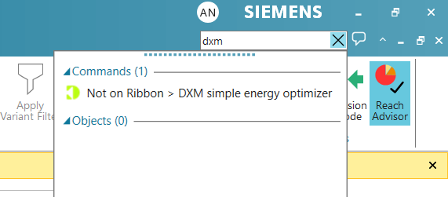
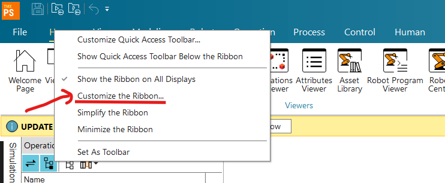
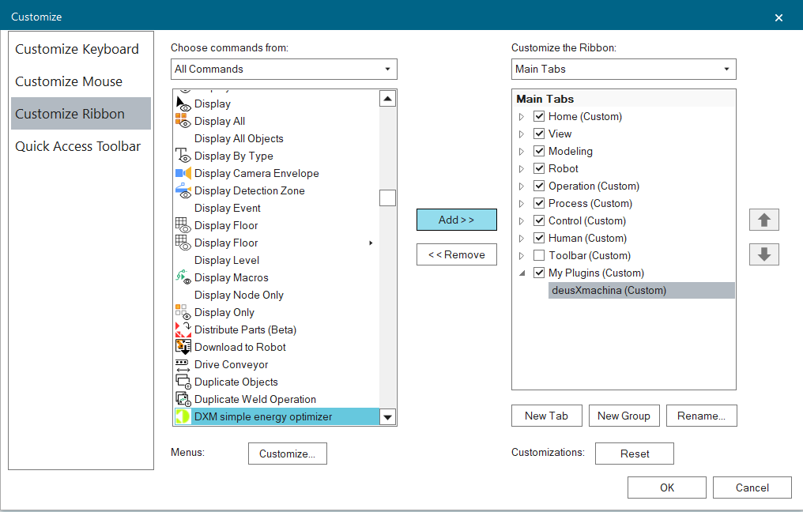

# Technical Documentation

This should help you get up and running in no time.

---

## Installation

### Prerequisites
- **Siemens Process Simulate** (developed against 2502 - let us know if there are any issues on other versions)

### Installation Steps

1. **Download the Installer**
   - Download `DeusXMachinaCommand_Setup_{version}.exe` from the [releases page](https://github.com/deusXmachina-dev/ProcessSimulatePlugin/releases)

2. **Run the Installer**
   - Follow the installation wizard prompts

#### Alternative installation method

1. **Download the assembly directly**
   - Download `DeusXMachinaCommand.dll` from the [releases page](https://github.com/deusXmachina-dev/ProcessSimulatePlugin/releases)

2. **Run `CommandReg.exe`**
   - `CommandReg.exe` is installed with your PS and should be available in your PS install directory (e.g.: `C:\Program Files\Tecnomatix_2502\eMPower\CommandReg.exe`)
   - Follow the command registration instructions

---

## Usage

### First start

We advise adding the pluggin to the ribbon when you first start process simulate after the plugin is installed.

To see that the plugin was successfuly installed click Ctrl+f in a process simulate study and type `DXM`, you should see that the plugin was found:

  

To add the command to the ribbon:

1. Right click on the ribbon and select Customize the ribbon
2. Search for the command and add it to a group on your ribbon

### Basic Workflow

1. Open the energy optimizer in process simulate
2. Choose operation and target cycle time
3. Click optimize
4. After a few seconds a optimized copy of your operation will be created

### Tips & Best Practices

- Use the plugin with signals disabled and in standard mode

We are working on making this run in the line simulation mode and with signals and it will be part of a future version of the plugin (contributions are welcome).

---

## Uninstallation

### Windows Uninstall

Use windows uninstall if you used the standard installation path - search for DeusXMachinaCommand among the programs.

### Command unregister

Use this only if you used `CommandReg.exe` for the installation.

1. Open `CommandReg.exe`
2. Follow the UI to unregister the command

---

## Troubleshooting

### Common Issues

Please let us know if you encounter issues. We'll be very happy to help you get going and fix any issues as soon as they are discovered.

---

## Support

For issues, questions, or feedback:
- Open an issue on [GitHub](https://github.com/deusXmachina-dev/ProcessSimulatePlugin/issues)
- Also feel free to contact us through [deusxmachina.dev](https://deusxmachina.dev/)
